# 🌊 海攤垃圾智慧巡檢系統

本專題結合：
-  Arduino 自走車
-  ESP32-CAM 無線影像傳輸
-  YOLOv8 AI 物件辨識
-  Flask Web Dashboard

建立一套「海洋垃圾智慧巡檢原型系統（Prototype）」。

系統可透過自走車移動巡邏，使用 ESP32-CAM 拍攝環境影像，並將圖片傳送至電腦端進行 YOLOv8 垃圾辨識，最後透過 Flask Dashboard 顯示辨識結果。

---

# 📌 專案目標

本專題希望模擬：

> 未來智慧海岸巡檢系統的概念原型。

透過 AI 與嵌入式系統整合，
嘗試建立一套具備：

- 自主移動
- 環境感測
- 無線影像傳輸
- AI 垃圾辨識

能力的智慧巡檢系統。

---

# 🧠 系統功能
• Arduino 自走車避障控制  
• ESP32-CAM 無線拍照  
• HTTP 影像傳輸  
• YOLOv8 垃圾辨識  
• Flask Dashboard 即時展示  
• 辨識結果統計  
• Bounding Box 標註  
• 模組化系統架構  

---

# 🏗️ 系統架構

```text
超音波感測器
        ↓
Arduino 自走車控制
        ↓
ESP32-CAM 拍攝影像
        ↓
WiFi / HTTP 傳輸圖片
        ↓
Python 接收影像
        ↓
YOLOv8 AI 垃圾辨識
        ↓
Flask Dashboard 顯示結果
```
---

# 🔌 系統配線圖
<div align="center">

  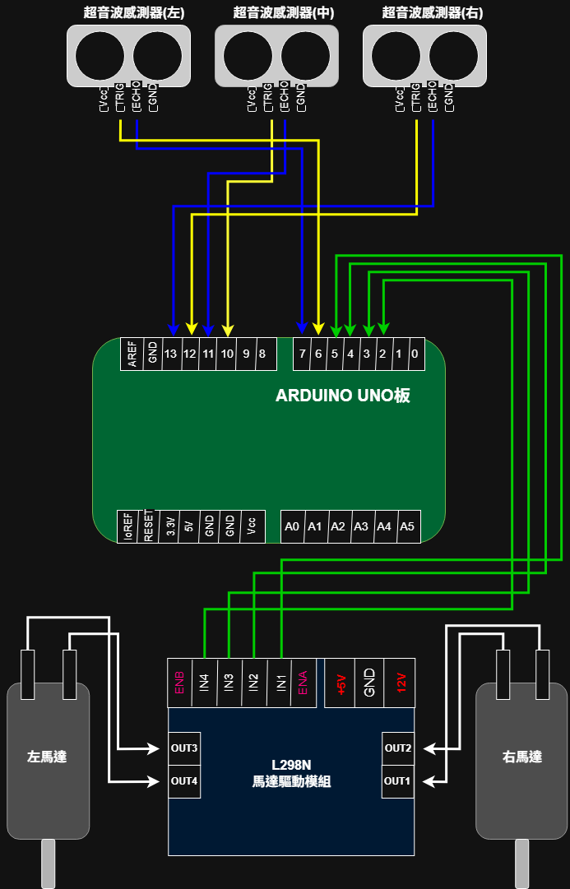
  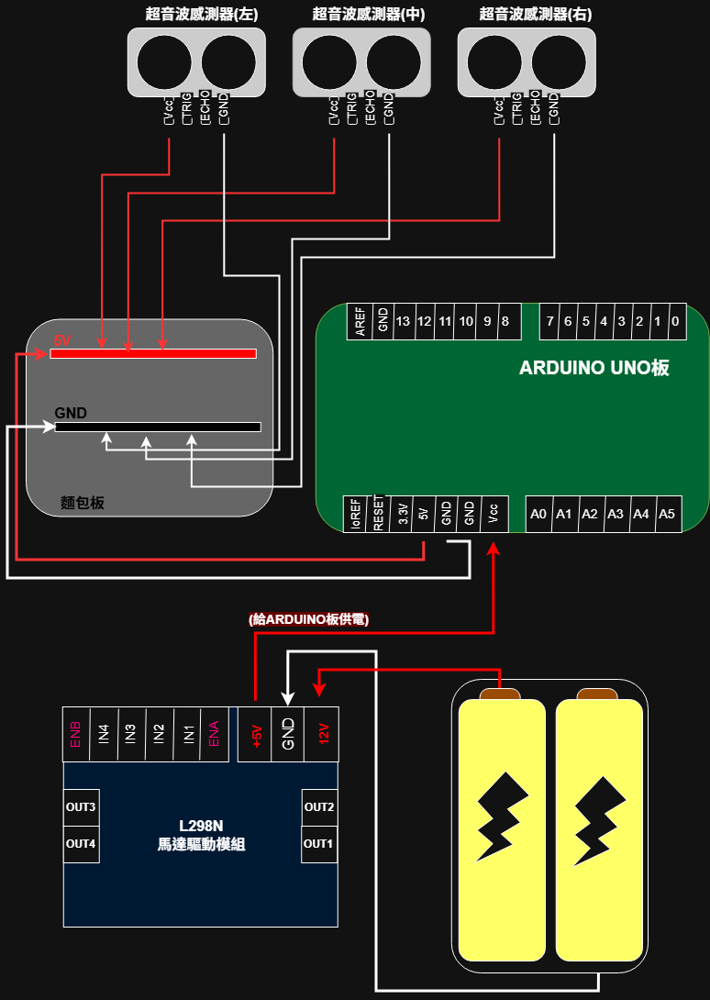

  <br><br>

  (通訊配線圖)　            　(電源配線圖)

</div>

---

# 🔄 系統流程

```text
自走車移動巡邏
        ↓
ESP32-CAM 每隔數秒拍照
        ↓
HTTP 傳送至電腦
        ↓
YOLOv8 進行垃圾辨識
        ↓
輸出辨識結果
        ↓
Dashboard 顯示統計資訊
```

---

# 📂 專案架構

```text
AI-Ocean-Waste-Detection-Car/
│
├── README.md
├── requirements.txt
│
├── arduino_car/
│   └── obstacle_car.ino
│
├── esp32_cam/
│   └── esp32_camera.ino
│
├── yolo_detection/
│   ├── train.py
│   └── detect.py
│
├── dashboard/
│   ├── app.py
│   └── templates/
│
└── docs/
    ├── architecture.png
    ├── workflow.png
    └── images/
```

---

# 🚗 自走車模組
- Arduino UNO
- HC-SR04 超音波感測器 ×3
- L298N 馬達驅動模組
- TT 馬達
- 自走車底盤
- 電池模組
- 履帶輪組

## 避障邏輯

```text
前方無障礙
      ↓
持續前進

前方偵測障礙物
      ↓
後退
      ↓
比較左右距離
      ↓
選擇空間較大的方向轉彎
```
---

# 📷 ESP32-CAM 模組

ESP32-CAM 負責：
- 拍攝環境影像
- 透過 WiFi 傳輸圖片
- HTTP 傳送至 Python Server

---

# 🧠 YOLOv8 AI 辨識模組

本專案使用：
- YOLOv8n
- 自訂資料集訓練
- Bottle / Can 類別辨識

資料集為人工蒐集與標註：
- 約 200+ 張圖片
- Roboflow 標註
- 小型實驗型資料集

---

# 🌐 Flask Dashboard

Dashboard 提供：
- 辨識結果展示
- 物件統計
- 圖表視覺化
- 辨識圖片顯示

---

# 🛠️ 使用技術

| 類別 | 技術 |
|---|---|
| Programming | Python / Arduino C++ |
| AI Model | YOLOv8 |
| Computer Vision | OpenCV |
| Web | Flask |
| Hardware | Arduino UNO / ESP32-CAM |
| Communication | HTTP / WiFi |
| Development Tools | VSCode / Arduino IDE |

---

# 🧪 專案開發歷程與架構調整
本專案在開發過程中，
經歷多次系統架構調整與測試。

---

# 📡 原始設計構想

原先規劃：

```text
超音波感測器偵測到障礙物
        ↓
Arduino 發送訊號給 ESP32-CAM
        ↓
ESP32-CAM 啟動拍照
        ↓
傳送圖片進行 YOLO 辨識
```

---

#  開發過程中遇到的問題
## 1️⃣ 系統演進:
### 🧪 第一階段：單一超音波感測器
僅使用一顆超音波感測器進行前方偵測，當遇到障礙物時進行固定或隨機轉向。

⚠️ 問題:
- 無法判斷左右空間
- 容易形成繞圈行為
- 避障效果不穩定

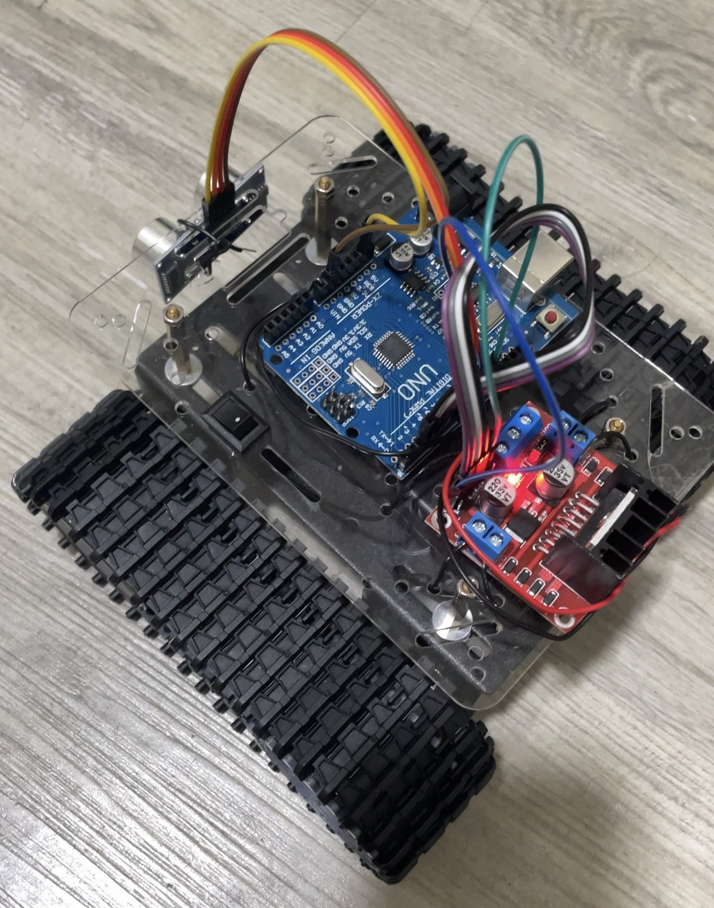

### 🧪 第二階段：伺服馬達掃描感測
將單一超音波感測器安裝於伺服馬達上，透過 0° / 90° / 180° 進行掃描，模擬多方向感測。

⚠️ 問題:
- 掃描時間過長導致反應延遲
- 機械轉動影響即時性
- 測距誤差影響決策

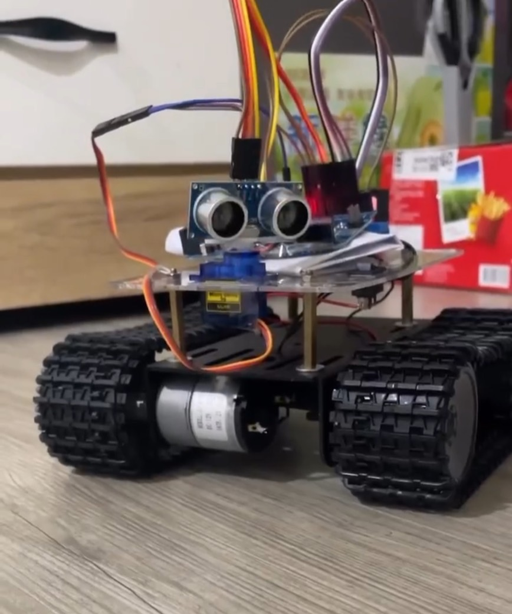

### 🧪 第三階段：三超音波感測器（最終架構）
改為固定式三感測器（左 / 中 / 右），即時回傳距離資訊。

✔️ 優點:
- 即時取得方向資訊
- 避免掃描延遲
- 提升整體穩定性

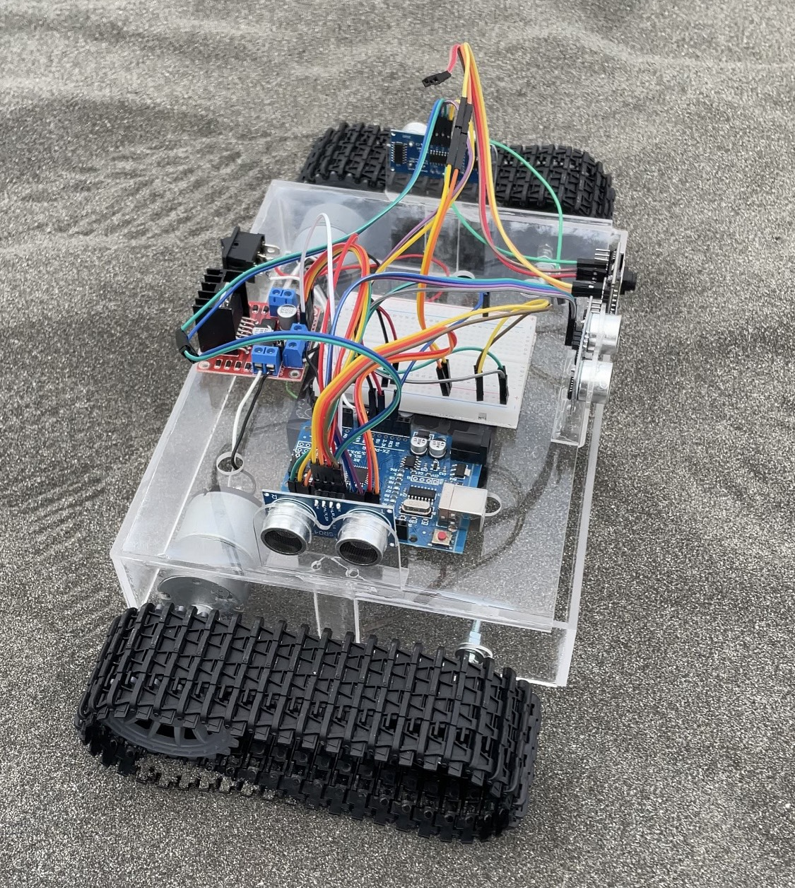
## 2️⃣ 履帶長度不一致

專案初期使用網路購買的「履帶式自走車底盤」進行組裝，實際測試後發現左右履帶長度存在差異。

造成自走車在直線行駛時，
會持續向其中一側偏移，
影響避障判斷與行走穩定性。

曾嘗試以下解決方式：
- 手動拆除履帶其中一節
- 調整履帶鬆緊程度
- 嘗試透過馬達速度平衡修正方向

但由於使用的馬達不支援速度控制（無 PWM 調速功能），因此無法透過程式精確修正左右速度差異。

最終僅能透過：
- 車體結構調整
- 履帶鬆緊微調
- 轉向時間修正

來降低偏移問題。

## 3️⃣ 沙灘地形造成車體卡住

在室內平坦地面測試時，
自走車可正常行駛。

但實際移至沙灘地形後，
由於車身底部離地高度不足，
導致底盤容易直接摩擦沙面而卡住。

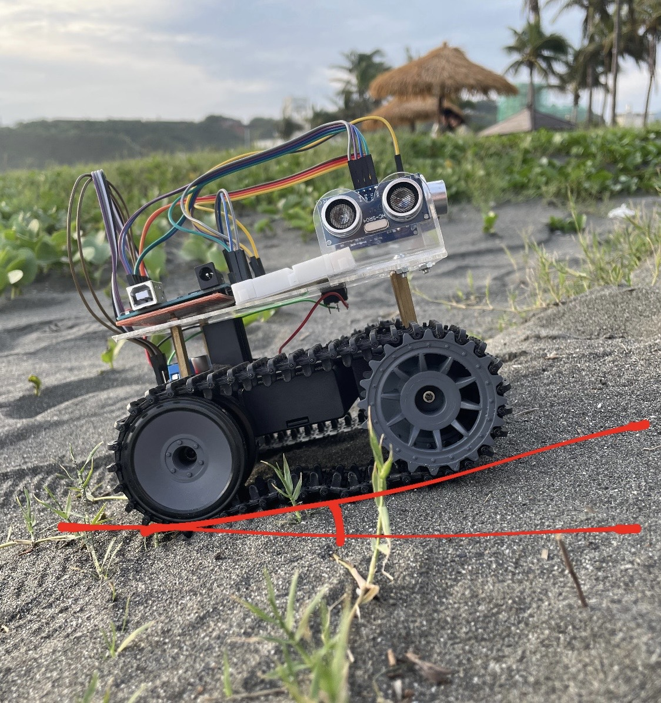

為了解決此問題，

後續重新設計並訂製「壓克力車架」，
並將車架整體抬高，提升離地高度以增加沙地通行能力。


##  4️⃣馬達進沙導致故障

即使完成車身抬高後，
自走車仍在長時間沙灘測試中出現新的問題。

由於沙灘環境中的細沙容易進入 TT 馬達內部，
導致：

- 馬達轉動阻力增加
- 馬達齒輪卡死
- 車輛無法繼續行駛

此問題對專案影響較大，
也讓團隊意識到：

實際戶外環境與室內測試存在很大差異。

## 5️⃣距離測量誤差

在實作中發現超音波感測器存在誤差問題：

- 偶發讀值為 0
- 測距不穩定
- 瞬間跳動數值

為了解決此問題，
改為多次測量取平均值，減少錯誤判斷提升穩定性，但仍無法完全消除極端誤差

## 6️⃣Arduino 與 ESP32-CAM 通訊問題
在實作過程中發現 Arduino 與 ESP32-CAM 之間的直接通訊整合存在穩定性問題，主要原因包括：

- Arduino 與 ESP32 分屬不同開發架構（AVR / ESP32）
- Serial / WiFi 混合通訊方式測試結果不穩定
- 缺乏穩定且低延遲的觸發機制
- 實際測試中訊號容易遺失或不同步
- 在專題時程內難以完成長時間穩定運行

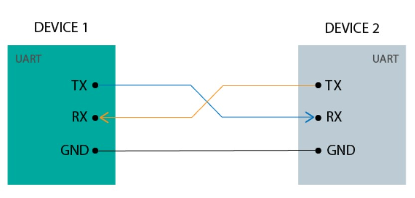

為了解決此問題，
確保系統能完整運作並完成辨識展示，
最終將架構調整為：

```text
ESP32-CAM 每隔固定時間自動拍照
        ↓
透過 HTTP 傳送影像至伺服器
        ↓
Python + YOLOv8 進行影像辨識
```

✔️ 優點:
- 系統整體穩定
- 可完整展示 AI 辨識流程
- 降低跨設備通訊複雜度
- 更容易進行測試與除錯

⚠️ 缺點:
- 無法實現「事件觸發式拍照」
- 可能產生重複或無效影像
- 效率較原設計略低

---

# 🔧 最終架構調整

基於：

- 專題完成度
- 系統穩定性
- 展示需求

最終改為：

```text
ESP32-CAM 每隔數秒自動拍照
        ↓
定期傳送影像至 YOLO Server
```

---

# 💭 架構調整後的影響

此方式雖然成功完成整體 AI 辨識流程，
但也產生一些限制：

- 可能拍到空白畫面
- 同一垃圾可能重複辨識
- 增加無效影像數量
- 無法做到真正事件觸發式辨識

然而：

此取捨成功讓整個系統完成整合展示，
也更加體會：

> 真實工程開發中，
> 「系統整合」與「理想設計」
> 往往需要在時間與穩定性之間取得平衡。

---

# 📸 成果展示

## 🚗 自走車


(自備辨識內容【寶特瓶】，實際海灘測試)

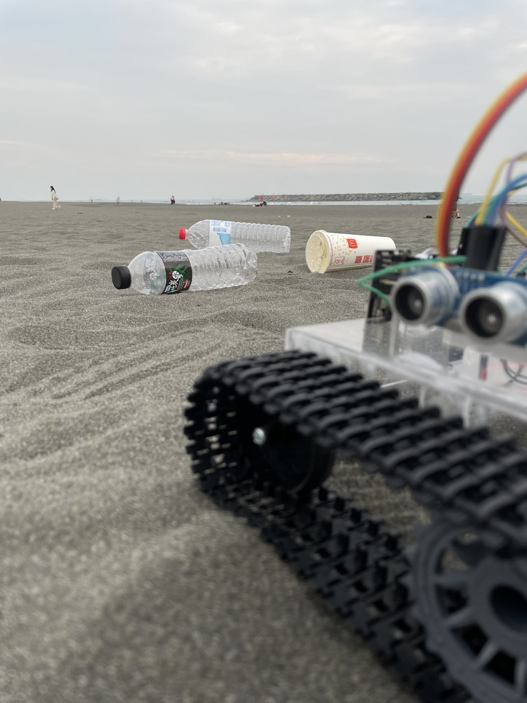

---

## 🧠 YOLO 辨識
(使用ROBOFLOW進行AI標註)

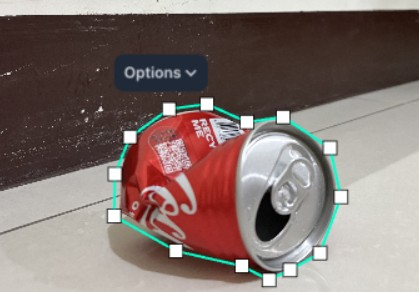

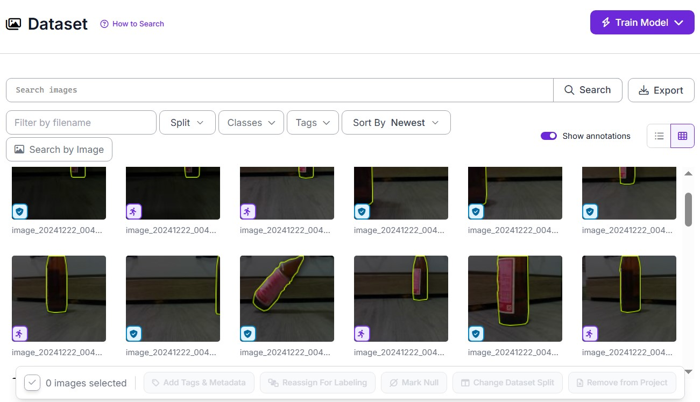


(使用WEB CAMERA進行影像辨識測試)

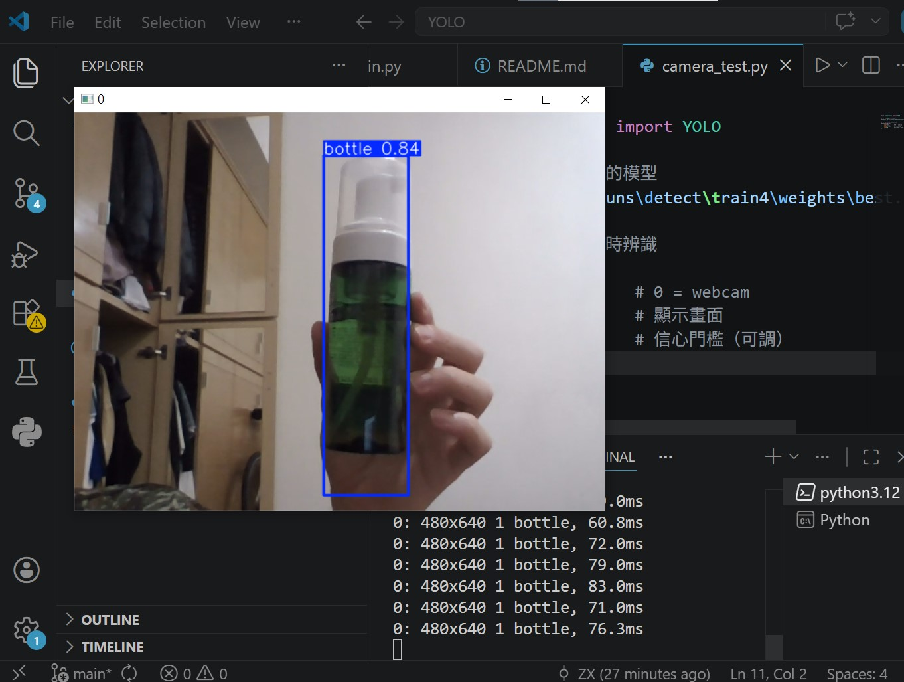

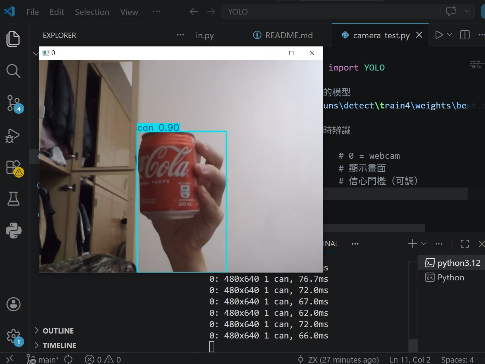

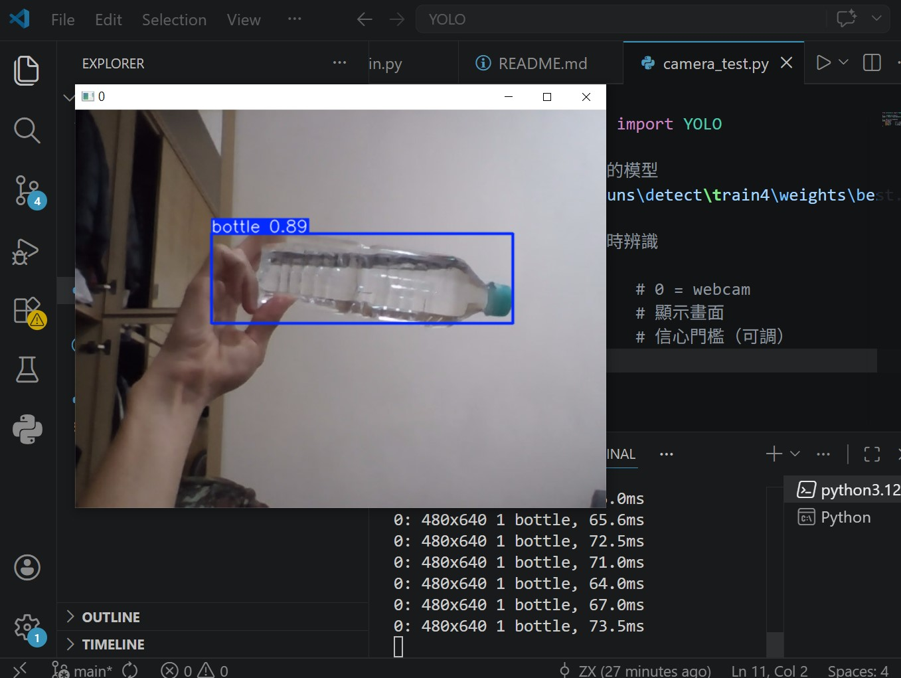

(專題製作實際辨識結果)

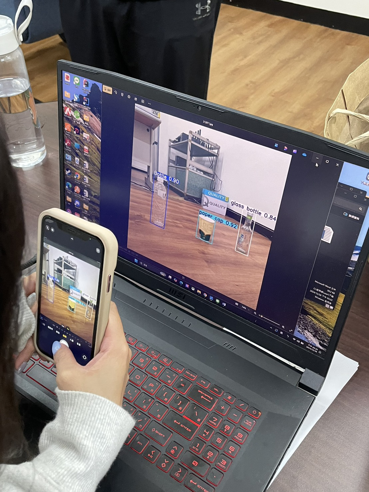

---

## 🌐 Dashboard 畫面

---

#  AI 模型實測觀察

在實際 webcam 與 ESP32-CAM 測試中，
觀察到一些有趣現象：

-  人手偶爾被辨識成 bottle
-  人臉可能被標記為 can
-  背景反光可能誤判
-  光線不足時辨識率下降


這些誤判也讓我更理解：

> AI 並不是「真正理解物體」，

> 而是學習影像中的統計特徵。

由於資料集規模較小（約 200+ 張），
模型目前仍屬於學習與實驗階段。

---

# 📈 未來可擴充方向

- Arduino 與 ESP32 穩定通訊
- 事件觸發式拍照
- 即時影像串流
- 雲端資料庫
- GPS 海岸巡檢
- 更大型垃圾資料集
- 即時地圖系統
- 太陽能供電
- AI 自主導航

---

# 💡 專案開發心得
## 專案心得

本專案除了程式開發之外，更重要的是實際涉及「硬體整合」與「系統測試」，讓我更完整理解嵌入式與 AI 系統在現實環境中的差異。

在開發過程中，遇到的問題往往不僅來自程式邏輯本身，而是來自整體系統的協作與外部條件，例如：

- 機構設計與車體穩定性（履帶、底盤高度等）
- 實際地形環境限制（沙地、摩擦力、卡住問題）
- 硬體設備差異與限制（馬達無法調速、感測器誤差）
- 外部環境影響（光線變化、反射、噪聲干擾）

這些因素讓我理解到：
> 系統能否「正常運作」，往往比單一功能是否「寫得出來」更重要。

---

在軟硬體整合的過程中，也遇到多次架構調整，例如：

- 原本希望使用「超音波觸發拍照」來提升效率
- 但因 Arduino 與 ESP32-CAM 通訊穩定性不足
- 最終改為「定時拍照 + HTTP 傳輸」的架構

這個過程讓我體會到：
> 工程開發並不是追求最理想的設計，而是在限制條件下找到最穩定可行的解法。

---

此外，在 YOLO 模型實測過程中，也觀察到許多有趣但實際的問題，例如：

- 小型資料集導致辨識泛化能力有限
- 人手或非目標物體會被誤判
- 光線與背景變化會明顯影響結果

這讓我更理解 AI 模型的本質：
> 模型並不是「理解世界」，而是學習資料中的統計特徵與模式。

---

## 總結

透過這次專題，我最大的收穫不只是完成一個 AI 系統，而是學會如何面對「真實工程問題」：

- 如何在限制中做系統取捨
- 如何讓不同模組成功整合
- 如何在不完美條件下完成可運作系統
- 如何從錯誤與測試中調整設計方向

這次專案也讓我更清楚理解：

> 工程的核心不只是「寫出功能」，而是「讓整個系統穩定運作並能被實際使用」。
---

# ⚙️ 安裝方式

## 1️⃣ Clone 專案
```bash
git clone GitHub網址
```
---

## 2️⃣ 安裝套件

```bash
pip install -r requirements.txt
```
---

# ▶️ 執行方式
## 啟動 YOLO 辨識

```bash
python detect.py
```

## 啟動 Flask Dashboard

```bash
python app.py
```

開啟瀏覽器：

```text
http://127.0.0.1:5000
```
---

# 作者

Sam Lin